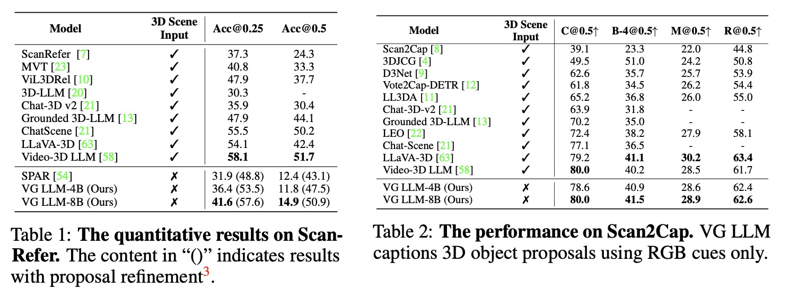
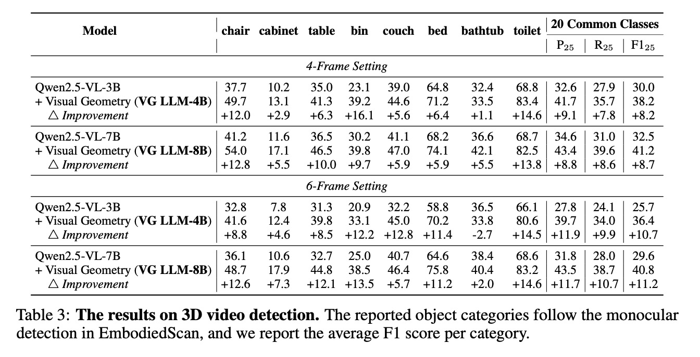
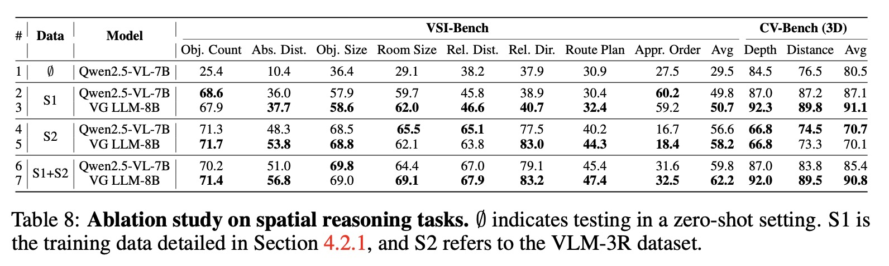

# Learning from Videos for 3D World: Enhancing MLLMs with 3D Vision Geometry Priors

<div align="center" margin-bottom="3em">
<a href="https://arxiv.org/abs/2505.24625" target="_blank">
</a>
<a href="assets/VG_LLM_Neurips_2025.pdf" target="_blank">
</a>
<a href="https://lavi-lab.github.io/VG-LLM/" target="_blank">
    
</a>
<a href="https://huggingface.co/datasets/zd11024/VG-LLM-Data" target="_blank">
    
</a>

</div>
&nbsp

<div align="center" margin-bottom="3em">
<a target="_blank" href="https://github.com/zd11024">Duo Zheng<sup>*</sup></a>,
<a target="_blank" href="https://sega-hsj.github.io/">Shijia Huang<sup>*</sup></a>, 
<a target="_blank" href="https://github.com/lyy1994">Yanyang Li</a> and 
<a target="_blank" href="https://lwwangcse.github.io/">Liwei Wang<sup>&ddagger;</sup></a>

<sup>*</sup>Equal contribution.
<sup>&ddagger;</sup> Corresponding author.

<strong>
The Chinese University of Hong Kong<br>
</strong>
</div>
&nbsp;

Previous research has investigated the application of Multimodal Large Language
Models (MLLMs) in understanding 3D scenes by interpreting them as videos.
These approaches generally depend on comprehensive 3D data inputs, such as
point clouds or reconstructed Bird’s-Eye View (BEV) maps. In our research, we
advance this field by enhancing the capability of MLLMs to understand and reason
in 3D spaces directly from video data, without the need for additional 3D input.

## 📢News
* [2025-09-23] We release the 7B size models fintuned on Qwen2.5-VL-7B-Instruct, which achieve better performance and inference speed. Check out our latest revision [here](assets/VG_LLM_Neurips_2025.pdf).
* [2025-09-18] Our paper has been accepted by NeurIPS 2025!


## ✨Architecture Overview

VG-LLM integrates a 3D visual geometry encoder (based on [VGGT](https://github.com/facebookresearch/vggt)) with a conventional 2D visual encoder.
1.  Input video frames are processed by both encoders. The 2D encoder extracts semantic-aware visual features from individual images. The 3D visual geometry encoder processes the sequence to produce globally geometry-aware visual features, capturing inter-frame correspondences.
2.  Features from both encoders are fused at the patch level.
3.  These fused, geometry-augmented visual features, along with text embeddings of a question, are fed into an MLLM backbone ([Qwen2.5-VL](https://github.com/QwenLM/Qwen2.5-VL)) to generate a response.

<p align="center">
    <br>
    <figcaption align="center">The architecture of our VG LLM.</figcaption>
</p>


## 🚀Main Results Highlights
* **3D Visual Grounding (ScanRefer):** Our
8B model achieves an accuracy of 41.6% at an IoU threshold of 0.25, surpassing the 31.9% accuracy
of SPAR by a significant margin of 9.7 points.

    <p align="center">
        <br>
    </p>

* **3D Dense Captioning (Scan2Cap):** Achieves 80.0 C@0.5 and 41.5 B-4@0.5, which are comparable
to previous SOTA approaches.

* **3D Video Object Detection (curated from EmbodiedScan):** Shows significant recall improvement (e.g., +19.3 F1 for common classes in 6-frame setting) by better handling egocentric-allocentric transformations.

    <!-- <p align="center">
        <br>
    </p> -->

* **Spatial Reasoning (VSI-Bench):** Archieves an average score of 50.7%, surpassing Gemini-1.5-Pro.

* **Effect of Geometry and Data Composition:** The results show consistent gains after integrating the 3D geometry into the model architecture with the
different data compositions.

    <p align="center">
        <br>
    </p>

<details>
<summary>Visualization results of VG LLM in 3D visual grounding tasks.</summary>
<p align="center">
    <br>
    <figcaption align="center">Our model can identify the frame index in which the targer object appears in a video stream, as well as its oriented 3D bounding box in the current frame. In this illustration, we show the video, the model's predicted oriented 3D bounding boxes (highlighted in green), and the ground truth 3D oriented bounding boxes (highlighted in blue). As shown in the figure, our model can effectively identify spatial relationships such as "far away," "opposite," and "next to" based on the video input.</figcaption>
</p>
</details>

<details>
<summary>Visualization results of VG LLM in 3D video object detection.</summary>
<p align="center">
    <br>
    <figcaption align="center">Our model can identify all objects througtout a video and output their oriented 3D bounding boxes in the unified coordinate system. As shown in the figure, our model can effectively detect objects of different granularities, including sink, bin, telephone, etc., and output their bounding boxes in a unified coordinate system.</figcaption>
</p>
</details>


## ⚙️Setup

1.  **Clone the repository:**
    ```bash
    git clone [https://github.com/lavi-lab/VG-LLM](https://github.com/lavi-lab/VG-LLM)
    cd VG-LLM
    ```

2.  **Create a Conda environment and install dependencies:**
    We recommend using Python 3.10.
    ```bash
    conda create -n vgllm python=3.10
    conda activate vgllm
    pip install -e .
    ```


## 📊Datasets

VG-LLM is trained and evaluated on a variety of datasets:

* **3D Scene Understanding:**
    * **3D Visual Grounding:** [ScanRefer](https://github.com/daveredrum/ScanRefer), with 24 uniformly sampling frames per scene.
    * **3D Dense Captioning:** [Scan2Cap](https://github.com/daveredrum/Scan2Cap), using Mask3D-detected object proposals extracted from [LEO](https://github.com/embodied-generalist/embodied-generalist). We uniformly sample 16 frames for each scene.
    * **3D Video Object Detection:** Curated from [EmbodiedScan](https://github.com/OpenRobotLab/EmbodiedScan), with consecutive frames sampled at 1 FPS.
* **Spatial Reasoning Instruction Tuning:**
    * [SPAR-7M](https://huggingface.co/datasets/jasonzhango/SPAR-7M): We used a subset of ~234K samples (3% of original). Data prep follows official codebase, navigation type discarded.
    * [LLaVA-Video-178K (LLaVA-Hound split)](https://huggingface.co/datasets/lmms-lab/LLaVA-Video-178K): We used a subset of ~63K samples (25% of original). Frames sampled at 2 FPS, 4-8 frames total.
    * Evaluation Benchmarks: We adopt [VSI-Bench](https://huggingface.co/datasets/nyu-visionx/VSI-Bench), [CV-Bench](https://huggingface.co/datasets/nyu-visionx/CV-Bench), [BLINK](https://huggingface.co/datasets/BLINK-Benchmark/BLINK), [Video-MME](https://huggingface.co/datasets/lmms-lab/Video-MME), [TempCompass](https://huggingface.co/datasets/lmms-lab/TempCompass), [NextQA](https://huggingface.co/datasets/lmms-lab/NExTQA) for evaluation.


## Finetuned Models
Our models are built upon two variants of Qwen2.5-VL, [Qwen2.5-VL—3B-Instruct](https://huggingface.co/Qwen/Qwen2.5-VL-3B-Instruct)and [Qwen2.5-VL-7B-Instruct](https://huggingface.co/Qwen/Qwen2.5-VL-7B-Instruct), and are integrated with VGGT-1B as the 3D geometry encoder. 
We recommend adopting the 7B model as the backbone, as our experiments show it delivers both superior performance and faster inference speed.

| | Model Access |
|---|---|
| 3D Scene Understanding | [🤗VG LLM-3D-4B](https://huggingface.co/zd11024/vgllm-3d-vggt-4b)<br>[🤗VG LLM-3D-8B](https://huggingface.co/zd11024/vgllm-3d-vggt-8b) |
| Spatial Reasoning | [🤗VG LLM-QA-4B](https://huggingface.co/zd11024/vgllm-qa-vggt-4b)<br>[🤗VG LLM-QA-8B](https://huggingface.co/zd11024/vgllm-qa-vggt-8b) |

## Demo
* Download the demo data at this [link](https://huggingface.co/datasets/zd11024/VGLLM_demo_data) and place it at `data/demo_data`.
* Download the required model checkpoints according to the last section.
* Run the script `demo.ipynb`.


## Data Preparation

### 1. Structure
Before starting the training process, you need to download the required datasets and annotations according to the following folder structure.
```
data
├── evaluation
│   ├── scan2cap
│   ├── scanrefer
│   └── threedod
├── media
│   ├── llava_hound
│   ├── scannet
│   └── spar
└── train
    ├── llava_hound_255k.json
    ├── llava_hound_64k.json
    ├── scan2cap_train_16frames.json
    ├── scannet_det_train_4frames.json
    ├── scanrefer_train_24frames.json
    ├── spar_234k.json
    └── spar_7m.jsonl
```

### 2. Data for 3D Scene Understanding
  * **Annotations:** Download the annotation files from [VG-LLM-Data](https://huggingface.co/datasets/zd11024/VG-LLM-Data).
  * **Media Data:** Prepare preprocessed video frames following the instruction of [Video-3D LLM](https://github.com/LaVi-Lab/Video-3D-LLM/blob/main/scripts/3d/preprocessing/README.md).

### 3. Data for Spatial Reasoning
  * **Annotations:** Download the annotation files from [VG-LLM-Data](https://huggingface.co/datasets/zd11024/VG-LLM-Data).
  * **Video Data:** Download the media data of LLaVA-Video-178K (LLaVA-Hound split) from the [ShareGPTVideo](https://huggingface.co/datasets/ShareGPTVideo/train\_video\_and\_instruction/tree/main/train\_300k).
  * **SPAR Data:** Download the media data of SPAR from [SPAR-7M](https://huggingface.co/datasets/jasonzhango/SPAR-7M).


We have provided two example entries as follows
<details>
<summary>Example for LLaVA-Video-178K (LLaVA-Hound Split).</summary>

```json
{
    "id": "23230678_1",
    "conversations": [
        {
            "from": "human",
            "value": "<video>\nWhat is the contrast provided in the video's midway point?"
        },
        {
            "from": "gpt",
            "value": "In the midway point of the video, a handgun is displayed on a surface covered with documents, providing a stark contrast to the earlier images of the cigarette being inhaled."
        }
    ],
    "data_source": "llava_hound",
    "video": "llava_hound/frames/23230678"
}
```

</details>

<details>
<summary>Example for SPAR-7M.</summary>

```json
{
    "id": "scene0012_01_1661",
    "conversations": [
        {
            "from": "human",
            "value": "<image>\n<image>\n<image>\nAssume the depth of box (red point) is 2.0. How much deeper or shallower is chair (green point) relative to table (blue point), measured in meters? Calculate or judge based on the 3D center points of these objects. The depth is calculated based on the image where the markers corresponding to these objects are located. Provide a numeric response with just one value."
        },
        {
            "from": "gpt",
            "value": "1.5"
        }
    ],
    "images": [
        "spar/scannet/images/scene0012_01/image_color/2626.jpg",
        "spar/scannet/images/scene0012_01/image_color/3321.jpg",
        "spar/scannet/images/scene0012_01/image_color/133.jpg"
    ],
    "spar_info": "{\"red_point\": [[395, 89]], \"blue_point\": [[494, 620]], \"green_point\": [[878, 737]], \"point_img_idx\": [[0, 2, 1]], \"type\": \"depth_prediction_oo_mv\"}"
}
```

</details>


### 4. Configure Data Paths

Next, you need to configure the data paths in the source code following Qwen-2.5-VL. Modify the `src/qwen_vl/data/__init__.py` file to ensure the script can locate your datasets.

  * `annotation_path`: This should point to the JSON or JSONL file containing your downloaded dataset annotations.
  * `data_path`: This can be left empty if the image and video paths specified in your annotation files are absolute paths. Otherwise, provide the directory where your data is stored.

## Training

We train two models separately for 3D scene understanding and spatial reasoning tasks. The following instructions are for 3D scene understanidng.

To start the training, execute the following script:

```bash
bash scripts/train/train_3d.sh
```

For spatial reasoning, run the following command:

```bash
bash scripts/train/train_sr.sh
```

#### Training Details
  * **Backbones**: Our models are built upon two sizes of Qwen2.5-VL—3B and 7B, and integrated with VGGT-1B as the 3D geometry encoder.
  * **Hardware:** Our experiments were conducted on a setup with 8x NVIDIA H800 (80G) GPUs.
  * **Hyperparameters:** We trained the model for one epoch using the Adam optimizer with a batch size of 64, a warmup ratio of 0.03, and a learning rate of 1e-5.
  * **Frozen Components:** During training, the visual encoder of the MLLM, the 3D geometry encoder, and the multimodal connector are kept frozen.
  * **Training Duration:**
      * 3D Scene Understanding: Approximately 12 hours for 8B model.
      * Spatial Reasoning: Approximately 9 hours for 8B model.

<!-- The training scripts will be released soon. -->
## Evaluation

Evaluation is performed using the [LMMs-Eval](https://github.com/EvolvingLMMs-Lab/lmms-eval) with greedy sampling for generation. For video benchmarks, 32 frames are uniformly sampled for VSI-Bench.

Please refer to the example evaluation script (`scripts/evaluation/eval.sh`) below for detailed command usage. You may need to adjust `model_path`, `benchmark`, or other parameters based on your specific setup and requirements.
```bash
set -e
export LMMS_EVAL_LAUNCHER="accelerate"

export NCCL_NVLS_ENABLE=0
benchmark=vsibench # choices: [vsibench, cvbench, blink_spatial]
output_path=logs/$(TZ="Asia/Shanghai" date "+%Y%m%d")
model_path=zd11024/vgllm-qa-vggt-8b

accelerate launch --num_processes=8 -m lmms_eval \
    --model vgllm \
    --model_args pretrained=$model_path,use_flash_attention_2=true,max_num_frames=32,max_length=12800 \
    --tasks ${benchmark} \
    --batch_size 1 \
    --output_path $output_path
```

For 3D scene understanding, please refer to the script `scripts/evaluation/eval_3d.sh` for more details. Notice that for 3D visual grounding, a frame index are asked to insert in front of each frame by setting `add_frame_index` to `true`.

## 📋Todo List

- [x] Release the model weights.
- [x] Release the inference demo.
- [x] Release the evaluation code, preprocessing data and training scripts for spatial reasoning.
- [x] Release the evaluation code, preprocessing data and training scripts for 3D scene understanding.

## Citation

If you find our work useful, please consider citing:

```bibtex
@article{zheng2025learning,
  title={Learning from Videos for 3D World: Enhancing MLLMs with 3D Vision Geometry Priors},
  author={Zheng, Duo and Huang, Shijia and Li, Yanyang and Wang, Liwei},
  journal={arXiv preprint arXiv:2505.24625},
  year={2025}
}
```

## Acknowledgements

* This work is built upon excellent previous research, including [Qwen2.5-VL](https://github.com/QwenLM/Qwen2.5-VL), [VGGT](https://github.com/facebookresearch/vggt), [SPAR-7M](https://github.com/fudan-zvg/spar), [LLaVA-Video-178K](https://github.com/LLaVA-VL/LLaVA-NeXT), and various 3D datasets like [ScanNet](https://github.com/ScanNet/ScanNet), [ScanRefer](https://github.com/daveredrum/ScanRefer), [Scan2Cap](https://github.com/daveredrum/Scan2Cap), [EmbodiedScan](https://github.com/OpenRobotLab/EmbodiedScan).
* We thank the developers of [LMMs-Eval](https://github.com/EvolvingLMMs-Lab/lmms-eval) for their evaluation framework.
