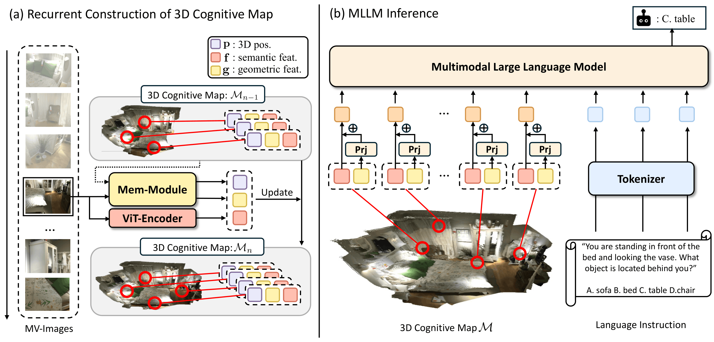

# Cog3DMap: Multi-View Vision-Language Reasoning with 3D Cognitive Maps

[](https://arxiv.org/abs/2603.23023)
[](https://cog3dmap.github.io)

**[Chanyoung Gwak](https://github.com/gwakcy), Yoonwoo Jeong, Byungwoo Jeon, Hyunseok Lee, Jinwoo Shin, Minsu Cho**

POSTECH · KAIST · RLWRLD

---



## Abstract

Multimodal large language models (MLLMs) struggle with precise spatial understanding from multi-view images. Cog3DMap addresses this by constructing an explicit **3D cognitive map** from multiple viewpoints and injecting it directly into the LLM context.

The framework:
- **Incrementally builds** a structured 3D map from multi-view images using a recurrent mechanism
- Maintains a **single token per spatial location** through a principled memory update that retains, updates, and expands tokens as new views arrive
- Fuses **semantic features** from the MLLM vision encoder with **geometric features** from a pretrained [Point3R](https://github.com/pointcloud3d/Point3R) model, creating spatially grounded tokens that enable precise distance estimation, object localization, and spatial relationship reasoning

## Results

| Benchmark | Score | vs. Prior Best |
|-----------|-------|----------------|
| VSTI-Bench | 67.5% | +8.7 pp |
| VSI-Bench | 65.1% | +3.9 pp |
| RoboFAC | Competitive | up to −90.2% visual tokens |

The model demonstrates genuine 3D spatial reasoning through learned attention patterns, without explicit supervision.

## Installation

Requires **Python 3.10** and CUDA-compatible GPUs.

```bash
# Clone the repository
git clone https://github.com/cog3dmap/cog3dmap.git
cd cog3dmap

# Install dependencies
pip install -e .
```

Key dependencies (installed automatically): PyTorch 2.5.1, Transformers 4.57.6, DeepSpeed 0.16.4, flash-attn 2.7.4, Qwen3-VL utilities.

> **Note:** `flash_attn` requires a compatible CUDA version. Install it separately if the above fails:
> ```bash
> pip install flash-attn==2.7.4.post1 --no-build-isolation
> ```

## Usage

### Demo

Run inference on sample images with a pretrained model:

```bash
python scripts/demo/demo_point3r.py
```

### Preprocessing

Preprocess ScanNet scenes in parallel across 8 GPUs:

```bash
bash scripts/demo/run_preprocess_simple.sh
```

Optional arguments: `run_preprocess_simple.sh [SAMPLE_CT] [SAVE_PATH]`
- `SAMPLE_CT`: number of samples per scene (default: 32)
- `SAVE_PATH`: output directory (default: `./output/scannet`)

Logs are written to `logs/preprocess_gpu_*.log`.

### Training & Evaluation

Train and evaluate the 8B model with memory feature fusion:

```bash
bash scripts/run/8b_memfeat.sh
```

This runs on 8 GPUs via SLURM. It trains on Scan2Cap with Point3R memory features and evaluates the resulting checkpoint.

## Citation

```bibtex
@article{gwak2025cog3dmap,
  title   = {Cog3DMap: Multi-View Vision-Language Reasoning with 3D Cognitive Maps},
  author  = {Chanyoung Gwak and Yoonwoo Jeong and Byungwoo Jeon and Hyunseok Lee and Jinwoo Shin and Minsu Cho},
  journal = {arXiv preprint arXiv:2603.23023},
  year    = {2025}
}
```
